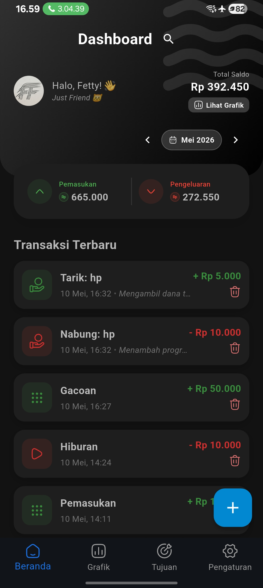
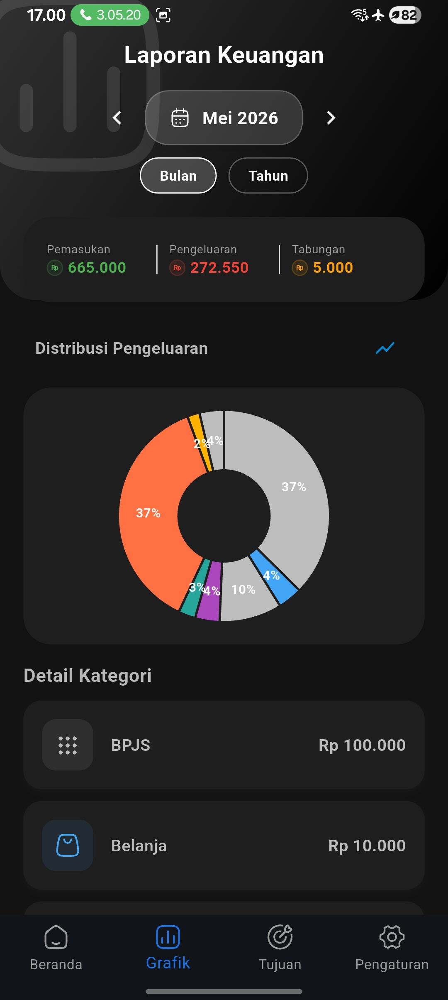
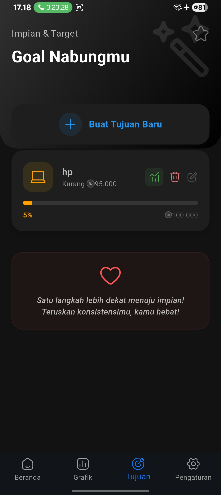
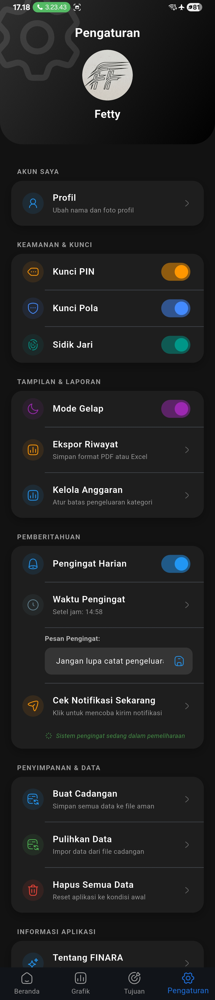

# Penjelasan APP FINARA
dan cara kerja app

link Download Drive Khusus Android:
https://drive.google.com/file/d/1Rzf1FrUk-lhEXoiHTTSsbjv86k4J1jTT/view?usp=sharing

---

## Panduan Penggunaan & Penjelasan Tampilan Aplikasi

Berikut adalah langkah-langkah penggunaan aplikasi FINARA beserta penjelasan dari setiap bagian:

### 1. Beranda (Home)

**Penjelasan Gambar:**
Halaman **Beranda** adalah layar utama saat Anda membuka aplikasi. Di sini Anda akan melihat ringkasan keuangan secara langsung, yang mencakup saldo saat ini, total pemasukan, dan total pengeluaran. Terdapat juga riwayat atau daftar transaksi terbaru agar Anda bisa memantau aliran dana dengan cepat.

**Langkah Penggunaan:**
- Saat membuka aplikasi, periksa ringkasan dana Anda di bagian atas.
- Untuk mencatat transaksi baru, klik ikon **Tambah (+)** yang tersedia di halaman ini, lalu pilih apakah itu "Pemasukan" atau "Pengeluaran".
- Isi nominal, kategori, dan catatan transaksi, lalu simpan.

---

### 2. Grafik (Charts/Analytics)

**Penjelasan Gambar:**
Halaman **Grafik** menyajikan visualisasi data keuangan Anda. Melalui diagram (seperti diagram lingkaran/pie chart atau diagram batang), Anda dapat dengan mudah melihat distribusi pengeluaran berdasarkan kategori (misalnya: Makanan, Transportasi, Hiburan).

**Langkah Penggunaan:**
- Navigasi ke menu **Grafik** (biasanya terdapat di bilah navigasi bawah).
- Pilih rentang waktu yang ingin Anda analisis (contoh: Mingguan, Bulanan, atau Tahunan).
- Evaluasi kategori mana yang memakan biaya paling besar untuk membantu Anda menekan pengeluaran di masa mendatang.

---

### 3. Tujuan (Goals)

**Penjelasan Gambar:**
Halaman **Tujuan** didesain untuk membantu Anda merencanakan dan melacak target tabungan. Gambar ini menampilkan daftar impian finansial Anda (seperti "Liburan" atau "Beli Kendaraan") dilengkapi dengan *progress bar* (bilah kemajuan) yang menunjukkan persentase dana yang telah terkumpul.

**Langkah Penggunaan:**
- Buka tab atau menu **Tujuan**.
- Klik tombol **Tambah Tujuan** untuk membuat target baru. Isi nama tujuan, total dana yang dibutuhkan, dan target waktu pencapaian.
- Secara berkala, perbarui (update) nominal tabungan yang sudah dialokasikan ke tujuan tersebut untuk melihat pergerakan *progress bar* hingga mencapai 100%.

---

### 4. Pengaturan (Settings)

**Penjelasan Gambar:**
Halaman **Pengaturan** memuat berbagai opsi konfigurasi profil dan aplikasi. Pada tampilan ini, Anda akan menemukan menu untuk mengubah mata uang, mengatur notifikasi pengingat, memilih tema aplikasi (Gelap/Terang), serta opsi keamanan dan manajemen data.

**Langkah Penggunaan:**
- Masuk ke menu **Pengaturan**.
- Anda dapat mengelola profil Anda di bagian akun.
- (Opsional) Lakukan *Backup* (pencadangan) data secara rutin agar data keuangan Anda tidak hilang jika berganti perangkat genggam.
- Sesuaikan preferensi lain seperti format mata uang atau keamanan (misalnya PIN/Biometrik) jika tersedia.
