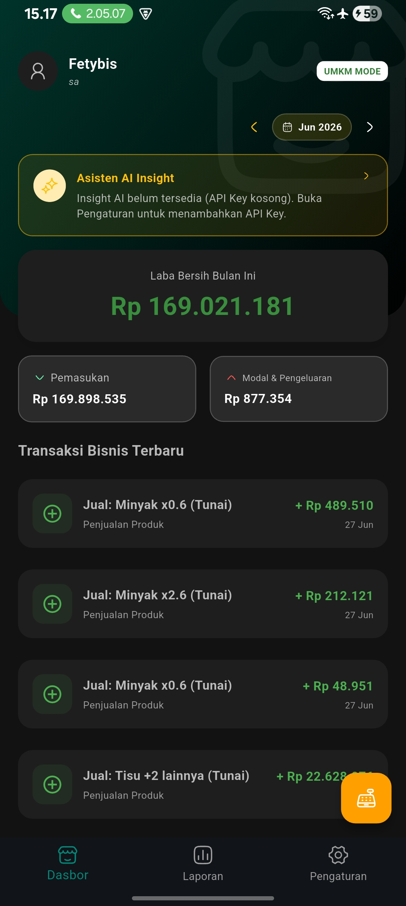
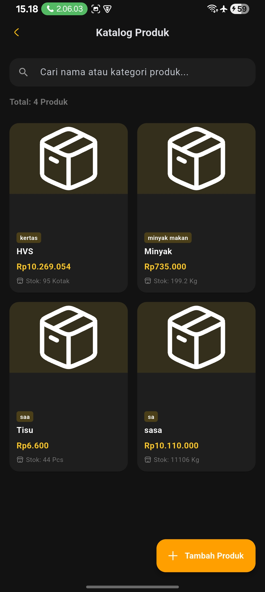
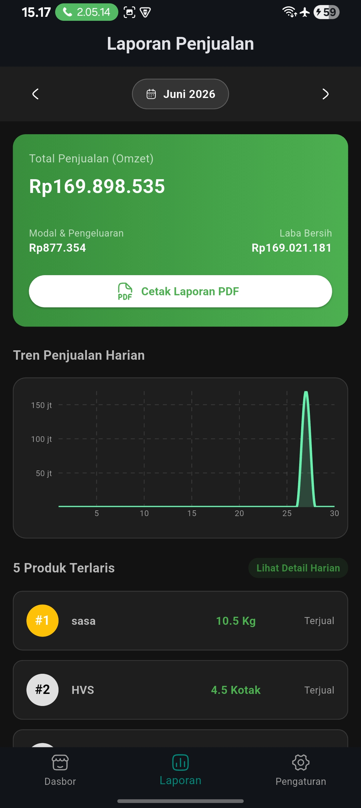
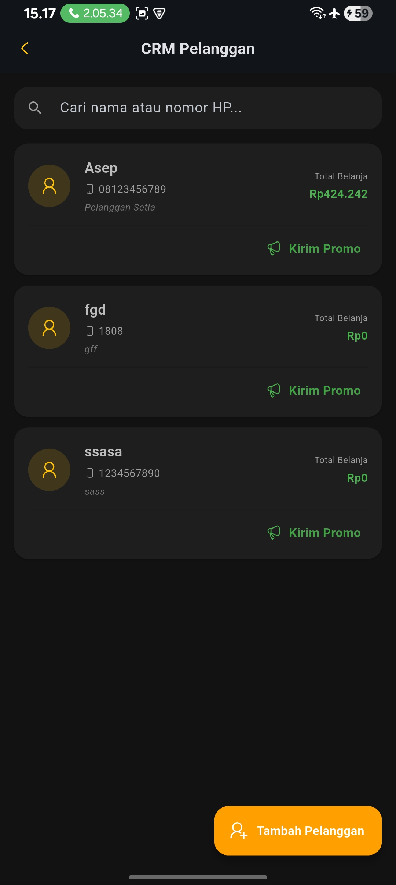
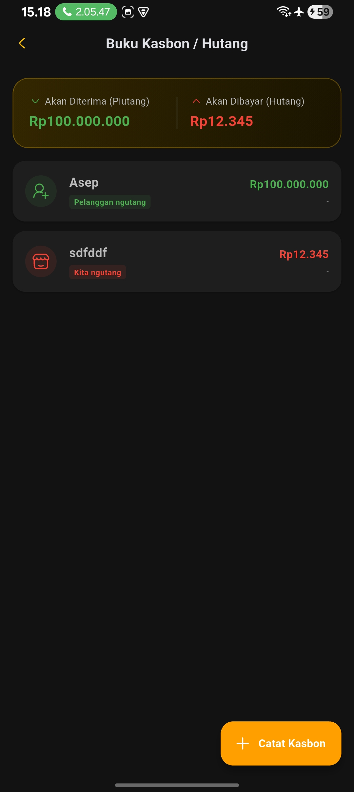
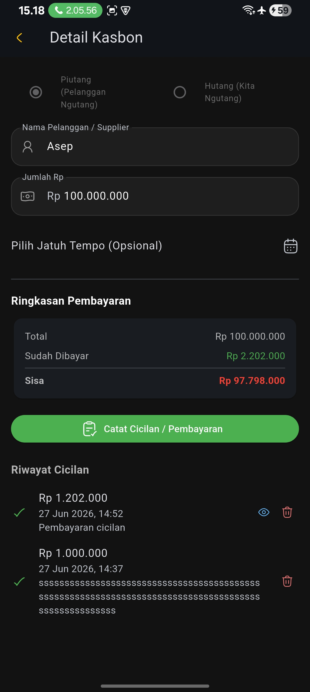
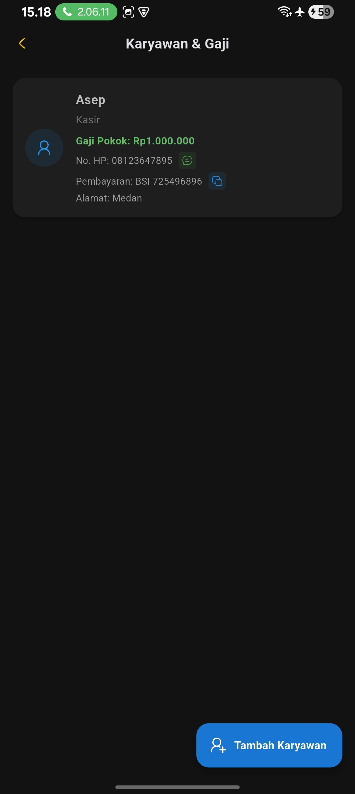
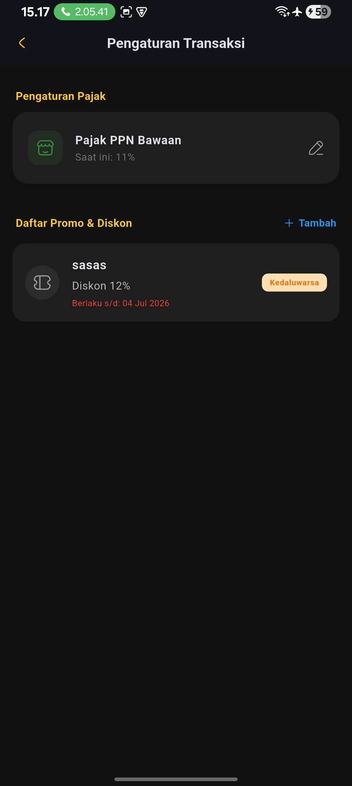

link Download Drive Khusus Android:
https://drive.google.com/file/d/1Rzf1FrUk-lhEXoiHTTSsbjv86k4J1jTT/view?usp=sharing

---

## Panduan Penggunaan & Penjelasan Tampilan Aplikasi

Aplikasi FINARA mendukung **2 Mode Utama**: **Mode Personal** untuk pencatatan keuangan pribadi dan **Mode Bisnis (UMKM)** untuk pencatatan transaksi serta manajemen operasional usaha.

---

## 📱 MODE PERSONAL
Mode Personal digunakan untuk mengelola keuangan pribadi harian dengan fitur pencatatan pemasukan, pengeluaran, visualisasi grafik, dan manajemen target tabungan.

| 🏠 1. Beranda (Home) - Personal | 📊 2. Grafik (Charts/Analytics) |
|:---:|:---:|
|  |  |
| **Penjelasan Tampilan:** Halaman **Beranda** adalah layar utama saat Anda membuka aplikasi dalam mode personal. Di sini Anda akan melihat ringkasan keuangan secara langsung, yang mencakup saldo saat ini, total pemasukan, dan total pengeluaran. Terdapat juga riwayat atau daftar transaksi terbaru agar Anda bisa memantau aliran dana dengan cepat.  **Langkah Penggunaan:** - Periksa ringkasan dana Anda di bagian atas halaman utama. - Untuk mencatat transaksi baru, klik ikon **Tambah (+)**, lalu pilih kategori "Pemasukan" atau "Pengeluaran". - Isi nominal, kategori, dan catatan transaksi, lalu simpan. | **Penjelasan Tampilan:** Halaman **Grafik** menyajikan visualisasi data keuangan pribadi Anda. Melalui diagram lingkaran (pie chart) atau diagram batang, Anda dapat melihat kontribusi pengeluaran berdasarkan kategori (seperti Makanan, Transportasi, Hiburan).  **Langkah Penggunaan:** - Navigasi ke menu **Grafik** pada bilah menu bawah. - Pilih filter rentang waktu (Mingguan, Bulanan, atau Tahunan). - Analisis kategori pengeluaran terbesar untuk membantu Anda menghemat pengeluaran. |

---

| 🎯 3. Tujuan (Goals) | ⚙️ 4. Pengaturan (Settings) |
|:---:|:---:|
|  |  |
| **Penjelasan Tampilan:** Halaman **Tujuan** membantu Anda merencanakan dan melacak pencapaian target tabungan impian Anda (seperti "Liburan" atau "Beli Kendaraan") lengkap dengan *progress bar* persentase dana terkumpul.  **Langkah Penggunaan:** - Buka menu **Tujuan**. - Klik tombol **Tambah Tujuan** untuk membuat target tabungan baru dengan nama, nominal target, dan target waktu. - Update nominal tabungan secara berkala untuk memantau kemajuan hingga 100%. | **Penjelasan Tampilan:** Halaman **Pengaturan** memuat konfigurasi profil, pengaturan mata uang, notifikasi pengingat, tema aplikasi (Gelap/Terang), serta opsi keamanan dan pencadangan data.  **Langkah Penggunaan:** - Masuk ke menu **Pengaturan**. - Kelola informasi akun dan sesuaikan preferensi format mata uang. - Gunakan fitur **Backup** (pencadangan) data secara rutin agar catatan keuangan aman jika berganti perangkat. |

---

## 💼 MODE BISNIS (UMKM MODE)
Mode Bisnis didesain khusus untuk para pelaku usaha mikro, kecil, dan menengah (UMKM) untuk melacak operasional bisnis, laba bersih, manajemen stok, laporan penjualan, hingga pengelolaan karyawan dan hutang-piutang (kasbon).

| 🏢 1. Dasbor UMKM | 📦 2. Katalog Produk |
|:---:|:---:|
|  |  |
| **Penjelasan Tampilan:** Layar utama Mode Bisnis yang memuat performa usaha bulan berjalan. Menampilkan indikator **UMKM MODE**, informasi **Laba Bersih Bulan Ini**, total **Pemasukan**, serta **Modal & Pengeluaran**. Di bagian bawah terdapat riwayat transaksi bisnis terbaru dan menu untuk membuka **Asisten AI Insight** (membantu analisis bisnis setelah API Key dikonfigurasi).  **Langkah Penggunaan:** - Pantau laba bersih secara real-time di bagian atas dasbor. - Gunakan tombol tambah transaksi di pojok kanan bawah untuk mencatat transaksi penjualan atau pengeluaran operasional baru. | **Penjelasan Tampilan:** Halaman manajemen inventaris produk yang dijual. Menampilkan daftar produk beserta kategori, harga jual, dan sisa stok yang tersedia (misalnya: Minyak, HVS, Tisu).  **Langkah Penggunaan:** - Klik **Tambah Produk** untuk memasukkan produk baru ke dalam katalog. - Masukkan nama produk, kategori, harga, dan jumlah stok awal. - Gunakan kolom pencarian di bagian atas untuk menemukan produk dengan cepat berdasarkan nama atau kategori. |

---

| 📈 3. Laporan Penjualan | 👥 4. CRM Pelanggan |
|:---:|:---:|
|  |  |
| **Penjelasan Tampilan:** Halaman analisis penjualan yang menyajikan total omzet, modal/pengeluaran, laba bersih, diagram grafik tren penjualan harian, serta daftar 5 produk terlaris. Terdapat juga tombol untuk mengekspor laporan keuangan.  **Langkah Penggunaan:** - Pilih bulan laporan pada bagian atas layar. - Analisis tren grafik harian dan pantau produk terlaris untuk merencanakan stok barang. - Klik **Cetak Laporan PDF** untuk mengunduh laporan keuangan usaha dalam format PDF yang rapi. | **Penjelasan Tampilan:** Fitur pengelolaan database pelanggan setia (*Customer Relationship Management*). Di sini tercatat nama pelanggan, nomor handphone, serta total belanja mereka selama menggunakan aplikasi FINARA.  **Langkah Penggunaan:** - Klik **Tambah Pelanggan** untuk mendaftarkan pelanggan baru. - Cari nama atau nomor HP pelanggan di kolom pencarian. - Klik tombol **Kirim Promo** untuk membagikan penawaran khusus atau menyapa pelanggan. |

---

| 📓 5. Buku Kasbon / Hutang | 📑 6. Detail & Riwayat Kasbon |
|:---:|:---:|
|  |  |
| **Penjelasan Tampilan:** Menu untuk mencatat dan memantau status utang-piutang bisnis. Layar memuat total piutang usaha yang akan diterima dan total utang bisnis kepada supplier/pihak lain yang harus dibayar.  **Langkah Penggunaan:** - Klik **Catat Kasbon** untuk merekam transaksi utang atau piutang baru. - Pilih nama pelanggan/supplier dan tentukan nominalnya. | **Penjelasan Tampilan:** Halaman detail dari salah satu catatan utang-piutang. Menampilkan status cicilan, sisa tagihan, tanggal jatuh tempo (opsional), serta riwayat pembayaran cicilan lengkap dengan tanggal dan jam pembayaran.  **Langkah Penggunaan:** - Pantau ringkasan pembayaran (Total, Sudah Dibayar, Sisa). - Klik **Catat Cicilan / Pembayaran** ketika pelanggan membayar cicilan atau ketika bisnis mencicil hutang untuk memperbarui data secara otomatis. |

---

| 🧑‍💼 7. Karyawan & Gaji | ⚙️ 8. Pengaturan Transaksi (Pajak & Promo) |
|:---:|:---:|
|  |  |
| **Penjelasan Tampilan:** Modul pengelolaan data staf atau karyawan operasional toko/bisnis. Menampilkan nama karyawan, jabatan (misalnya: Kasir), besaran gaji pokok, nomor kontak WhatsApp, alamat, serta informasi detail rekening/metode pembayaran gaji.  **Langkah Penggunaan:** - Klik **Tambah Karyawan** untuk mendaftarkan staf baru beserta informasi gajinya. - Gunakan tombol pintasan WhatsApp di samping nomor HP untuk menghubungi karyawan secara cepat. | **Penjelasan Tampilan:** Menu untuk mengatur konfigurasi default transaksi bisnis, meliputi pengaturan persentase Pajak PPN bawaan (misal: 11%) serta daftar promo atau diskon aktif yang sedang berjalan beserta masa berlakunya.  **Langkah Penggunaan:** - Klik ikon pensil pada **Pajak PPN Bawaan** untuk menyesuaikan persentase pajak usaha Anda. - Klik **+ Tambah** di bagian Daftar Promo & Diskon untuk membuat promo diskon baru dengan menetapkan nama promo, besaran persentase diskon, dan batas tanggal kedaluwarsa diskon tersebut. |sebut.
